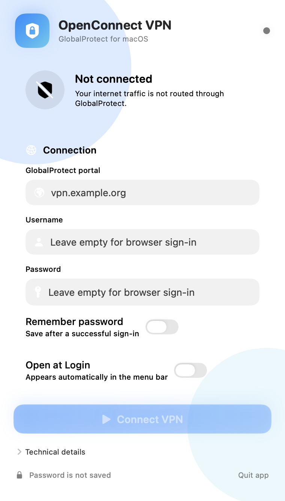

# OpenConnect VPN for GlobalProtect

[](https://github.com/reinardvandalen/openconnect-globalprotect-macos/actions/workflows/build.yml)
[](https://github.com/reinardvandalen/openconnect-globalprotect-macos/releases/latest)
[](LICENSE)
[](#requirements)

An unofficial, fully native macOS menu bar client for Palo Alto Networks GlobalProtect-compatible VPN portals, powered by [OpenConnect](https://www.infradead.org/openconnect/).

The app is designed for Apple Silicon Macs and supports username/password authentication followed by a separate MFA challenge, as well as browser-based SAML authentication when offered by the VPN portal.

> [!IMPORTANT]
> This project is not affiliated with, endorsed by, or supported by Palo Alto Networks. Your organization may block third-party VPN clients or require additional device-compliance checks.

## Screenshot

<p align="center">
  
</p>

## Languages

The app is available in English, Dutch, and German. It automatically follows your macOS language preference. You can also choose a language specifically for OpenConnect VPN in **System Settings → General → Language & Region → Applications**.

## Features

- Native SwiftUI menu bar interface without a Dock icon.
- Localized interface in English, Dutch, and German.
- Clear connected, disconnected, connecting, and error states.
- Username/password authentication with a separate MFA prompt.
- Browser-based SAML authentication through the default macOS browser.
- Optional encrypted password storage in macOS Keychain.
- MFA codes and temporary VPN cookies are never stored.
- VPN start and stop operations require macOS administrator approval.
- Optional launch at login through Apple's Login Item API.
- Liquid Glass interface on macOS 26 with a material fallback on macOS 14 and 15.
- Downloadable Apple Silicon build and reproducible local build scripts.

## Requirements

- Apple Silicon Mac (`arm64`).
- macOS 14 Sonoma or later.
- [Homebrew](https://brew.sh/).
- OpenConnect 9.0 or later.
- A GlobalProtect portal that permits OpenConnect and the selected authentication method.

Install OpenConnect first:

```bash
brew install openconnect
```

On Apple Silicon, Homebrew normally installs OpenConnect at `/opt/homebrew/bin/openconnect`. The app also checks several common alternative locations.

## Download and install

1. Download the latest [`OpenConnectVPN-arm64.zip`](https://github.com/reinardvandalen/openconnect-globalprotect-macos/releases/latest/download/OpenConnectVPN-arm64.zip).
2. Extract the ZIP archive.
3. Move **OpenConnect VPN.app** to the **Applications** folder.
4. On first launch, Control-click the app and choose **Open**.

The downloadable build is ad hoc signed, but it is not notarized with a paid Apple Developer ID certificate. macOS may therefore show a Gatekeeper warning on first launch. Review the source and build the app yourself if you require a fully auditable installation.

## Usage

1. Open **OpenConnect VPN** from the Applications folder. A shield icon appears in the menu bar.
2. Enter the GlobalProtect portal, for example `vpn.example.org` or `https://vpn.example.org`.
3. Enter your username and password for a regular GlobalProtect login. Enable **Remember password** if you want to store the password in macOS Keychain. Leave the password empty for browser-based SAML authentication.
4. Select **Connect VPN**.
5. Enter the MFA code when prompted, or complete authentication in the default browser.
6. Approve the macOS administrator prompt to start the protected tunnel.

Stopping the VPN requires administrator approval as well, because OpenConnect manages the tunnel as `root`. When the app is closed while connected, it first attempts to stop the tunnel safely.

### Menu bar status

| Icon state | Meaning |
|---|---|
| Crossed-out shield | VPN disconnected |
| Shield | Authenticating, awaiting approval, or connecting |
| Filled lock shield | VPN connected |
| Shield with exclamation mark | Connection failed or ended unexpectedly |

## Authentication and security model

OpenConnect authentication runs in two phases:

1. The app runs `openconnect --protocol=gp --authenticate` as the signed-in user. For regular authentication, the password is sent through standard input and a separate in-app field appears when OpenConnect requests MFA. For compatible SAML configurations, `--external-browser=/usr/bin/open` opens the default browser.
2. After authentication succeeds, the app writes only the temporary VPN cookie to a randomly named file with `0600` permissions. macOS then requests administrator approval to start OpenConnect with `--cookie-on-stdin`. The temporary file is deleted immediately.

The app:

- stores a password only after an explicit choice and a successful login;
- stores remembered passwords as generic passwords in macOS Keychain;
- removes the Keychain password when **Remember password** is disabled;
- never stores MFA codes or VPN cookies in UserDefaults or Keychain;
- never stores the macOS administrator password;
- never places the VPN cookie in process arguments;
- removes cookie values from visible technical logs;
- accepts HTTPS portal addresses only;
- reuses the server certificate fingerprint and DNS resolution returned by the authentication phase when available.

## Known limitations

- Some organizations block unofficial clients or require a Host Information Profile (HIP). Connectivity may be refused or restricted without the required HIP report.
- Browser-based MFA works only when the GlobalProtect configuration exposes an external-browser flow to OpenConnect. Embedded or vendor-specific SAML flows may not work.
- OpenConnect is intentionally not bundled or installed by the app. It remains a separate Homebrew-managed dependency.
- The distributed app is ad hoc signed and not notarized. Public distribution without Gatekeeper warnings requires an Apple Developer ID certificate and Apple notarization.
- Only Apple Silicon builds are currently provided.

## Build from source

Xcode Command Line Tools are sufficient:

```bash
git clone https://github.com/reinardvandalen/openconnect-globalprotect-macos.git
cd openconnect-globalprotect-macos
make test
make package
```

The packaged app and ZIP archive are written to `dist/`. To install the local build directly into `/Applications`, run:

```bash
make install
```

## Development

The project uses Swift Package Manager and contains:

- `OpenConnectCore`: portal validation, authentication parsing, log sanitization, and safe shell quoting;
- `OpenConnectVPN`: the SwiftUI menu bar app, state management, and VPN process control;
- `OpenConnectLauncher`: a minimal bundled helper that resets inherited signal masks before launching OpenConnect;
- `Scripts`: Apple Silicon build, app bundling, and ZIP packaging scripts;
- GitHub Actions: tests and a downloadable Apple Silicon artifact for pushes to `main` and version tags.

Run the tests:

```bash
swift test
```

Create a release build:

```bash
./Scripts/package-app.sh
```

## Contributing

Bug reports and focused pull requests are welcome. Please do not include VPN credentials, portal cookies, MFA codes, private server addresses, or unredacted logs in issues or pull requests.

Before submitting a change, run:

```bash
swift test
./Scripts/package-app.sh
```

## License and trademarks

The source code in this repository is available under the [MIT License](LICENSE).

OpenConnect is a separate project distributed under the LGPL-2.1-only license and is not included in this repository. GlobalProtect is a trademark of Palo Alto Networks. This project is not affiliated with or endorsed by Palo Alto Networks.
